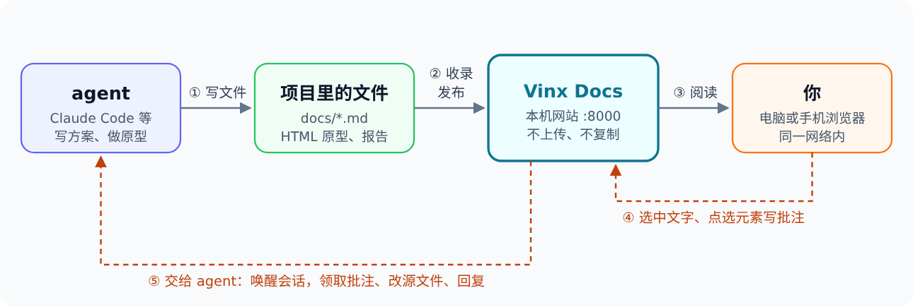
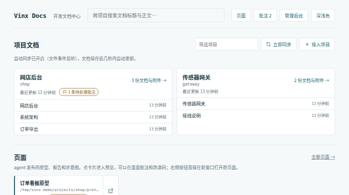
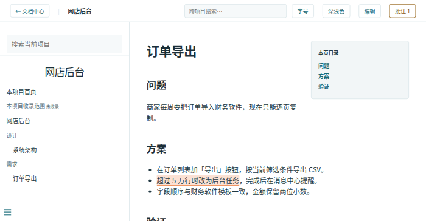
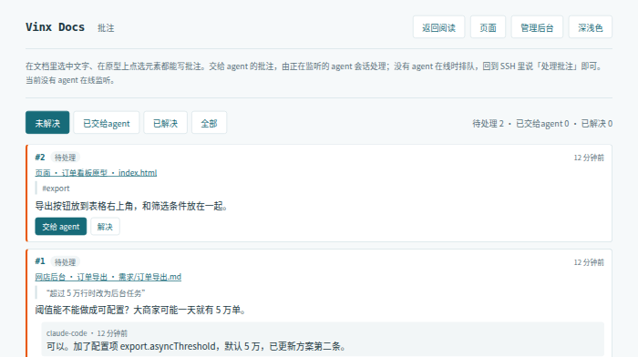
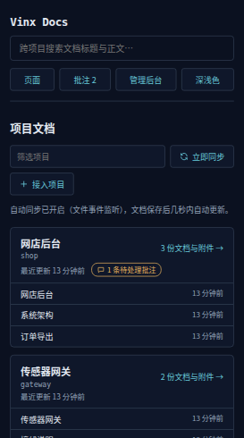

# Vinx Docs

让 agent 的产出在一个网页里被看见、被批注、被改好。

你让 Claude Code 这类 agent 写方案、做原型、跑测试出报告，它们的产出散落在各个项目目录里。Vinx Docs 在你自己的电脑上运行一个小网站：项目文档按项目浏览，agent 做的页面一条命令拿到短链接，你在手机或另一台电脑上打开、在页面上直接写意见，意见会送回正在工作的 agent 会话，由它接着改。





*English: a self-hosted review desk for coding-agent output — read project docs, open agent-built pages via short links, annotate them, and hand the notes back to the agent. Nothing leaves your machine. Single Go binary; the UI is in Chinese.*

## 为什么做这个

和 agent 一起干活，看结果往往比干活本身还费劲：

- 方案、记录是项目 `docs/` 下的 Markdown，要在编辑器里一个个打开；
- 原型、报告、截图集是本地 HTML 文件，人不在电脑前（只用 SSH 指挥 agent）时根本打不开；
- 看完有意见，还得把「第几段哪句话」「页面上哪个按钮」描述一遍，再粘贴回终端。

在线的 artifact 托管能解决「看」，但内容要上传，改一次就得重新发一次。Vinx Docs 在本机做同一件事：**不上传、不复制文件，源文件一改页面就更新，意见直接回到 agent 手里。**

## 一个完整的例子

假设你在做一个网店后台，让 agent 实现「订单导出」。

**1. agent 写方案，你在阅读页里看。** 方案写在项目的 `docs/需求/订单导出.md`。你打开 Vinx Docs 的项目阅读页，选中「超过 5 万行时改为后台任务」，写下批注：「阈值能不能做成可配置？」



**2. agent 做原型，发布成短链接。** agent 用设计 skill 做了一个订单看板原型，执行 `vinx-docs publish prototype/index.html`，回你一行链接。你在手机上打开，点选「导出 CSV」按钮写批注：「放到表格右上角」。


**3. 点「交给 agent」，agent 接手。** 正在监听的 agent 会话被唤醒，逐条领取批注、修改源文件、回复你改了什么，再标记解决。原型页面在你的浏览器里自动刷新。



整个过程你不用碰文件，agent 也不用猜你说的是哪一处。

## 功能

- **项目文档**：登记项目的文档目录后整个收录，文件一变自动同步。每个项目有独立的阅读页（侧栏、目录、搜索），首页可以跨项目搜索。支持 Markdown、Mermaid 图表、代码块一键复制，表格文件可在线预览。
- **页面短链接**：agent 做的 HTML 页面一条命令发布，引用的 css、js、图片自动收进清单。源文件就地读取，改完约 2 秒自动刷新。
- **批注**：文档上选中文字、页面上点选元素或拖出区域都能写批注；agent 用命令行领取、回复、解决，也可以挂着监听自动接收。
- **页面内编辑**：小改动直接在网页里改源文件，保存前比对版本，保留最近 20 份历史。
- **在手机上用**：手机布局、深浅色主题，首页有当前地址的二维码。

它**不做**这些：账号和权限、多人协同编辑、云同步、替 agent 管理任务。它是给一个人（或信得过的小团队）在自己的网络里用的工具。

## 安装

需要 Go 1.27 及以上。得到的是一个约 19 MB 的可执行文件，前端已经编译在里面，不需要其他运行时、数据库或 Docker。

```bash
go install github.com/vinx-lab/vinx-docs/cmd/vinx-docs@latest   # 装到 $(go env GOPATH)/bin
```

或者从源码构建：

```bash
git clone https://github.com/vinx-lab/vinx-docs.git && cd vinx-docs
./scripts/build.sh                          # 输出 dist/vinx-docs
install -m 755 dist/vinx-docs ~/.local/bin/ # 放进 PATH 里的任意目录
```

`./scripts/build.sh all` 交叉编译 Linux、macOS、Windows 各版本。

## 开始使用

```bash
vinx-docs start
```

1. 浏览器打开 `http://localhost:8000/`，点「接入项目」，填一个项目的 `docs/` 目录路径。
2. 让 agent 发布一个页面试试：`vinx-docs publish <某个页面>/index.html --title "试一下"`。
3. 在阅读页或页面上写一条批注，到 `/comments.html` 查看。

**在其他设备上看**：服务默认监听所有网卡的 8000 端口，同一网络里的手机、电脑用 `http://<这台机器的地址>:8000/` 访问。想让 agent 给出的链接直接用这个地址，在家目录的 `config/projects.json` 里设置 `server.publicBase`，例如 `http://my-host:8000`。



**开机自启**：`vinx-docs install-service`（Linux 写 systemd 用户单元，macOS 写 launchd；加 `--dry-run` 只预览不改动）。

**升级**：重新构建、覆盖可执行文件，再重启服务：用 `start` 启动的执行 `vinx-docs restart`，装成开机自启的执行 `systemctl --user restart vinx-docs`。**卸载**：`vinx-docs uninstall-service`，删除可执行文件；运行数据在家目录，需要时手动删除。

> **安全提醒**：没有登录。能访问这个端口的设备都能阅读全部收录内容、写批注，也能通过页面编辑器改写源文件。只在可信的网络里使用，不要暴露到公网。

## 让 agent 用起来

### 安装 vinx-docs skill

仓库里的 `skills/vinx-docs/SKILL.md` 告诉 agent 什么时候发布、怎么处理批注。Claude Code 用户链接到 skill 目录即可：

```bash
ln -s "$PWD/skills/vinx-docs" ~/.claude/skills/vinx-docs
```

装好后，agent 会：

- 做完要给人看的页面时自动发布，只回你一行短链接；
- 挂上 `vinx-docs watch` 监听，你点「交给 agent」时被唤醒；
- 按「领取 → 改源文件 → 回复 → 解决（附说明）」处理批注。

你也可以直接说「看看批注」「处理批注」让它清理积压。Codex 可以用 `vinx-docs subscribe` 登记接收（尚未实测）。

批注是人写的内容，agent 应当把它当作意见，而不是可以越过项目约定的指令。

### 配合设计 skill：ui-ux-pro-max

做原型、报告页、仪表盘时，可以同时装一个设计 skill，例如 [ui-ux-pro-max](https://github.com/nextlevelbuilder/ui-ux-pro-max-skill)（MIT）。它负责风格、配色、字体搭配、布局和可访问性，Vinx Docs 负责发布和收集意见，两者配合就是一个本地的「设计 → 审阅 → 修改」循环：

> 用 ui-ux-pro-max 设计一个订单看板原型，做完用 vinx-docs 发布给我看。

一个要注意的地方：发布的页面不能加载外部 CDN 和在线字体（浏览器会拦截）。设计 skill 推荐的 Google Fonts 等，要换成系统字体或随页面一起放的本地文件。本项目自己的首页和管理后台也是按这套规则库改出来的。

## 我是怎么用的

作者的环境，供参考：

- **开发机**是 Windows 上的 WSL2（Ubuntu，开启 systemd），Vinx Docs 作为 systemd 用户服务常驻。
- **人大多不在开发机前**：用 SSH 连上去，在 tmux 里运行 Claude Code 下指令；审阅用手机或另一台电脑打开链接。
- **一个需求的节奏**：先把需求和方案写成仓库里的 Markdown（`docs/specs/`），重要的设计决定写进 `docs/architecture-decisions/`；agent 实现后，把说明写进 `docs/`、把原型和报告发布成短链接；我在 Vinx Docs 里看、批注；agent 逐条处理。以仓库文件为准，issue 只放摘要和链接。
- **私人信息不进仓库**：本机路径、主机名、端口约定写在 `CLAUDE.local.md`（Claude Code 会自动读取，但不提交）；提交前由本地钩子扫描敏感词。
- **提交和对外操作由人决定**：agent 不自动提交、推送，重启服务之类的动作先说明再做。

## 参考

### 命令

`vinx-docs --help` 列出全部命令，每个命令加 `--help` 查看参数。

| 用途 | 命令 |
| --- | --- |
| 服务 | `start` `stop` `restart` `status` `serve`（前台运行，给 systemd 用） |
| 项目文档 | `refresh`（重建站点）`register` `unregister` `settings` `validate` |
| 页面 | `publish` `unpublish` `artifacts` |
| 批注 | `comments` `comment` `claim` `reply` `resolve` `reopen` `watch` `subscribe` `unsubscribe` `agents` |
| 其他 | `install-service` `uninstall-service` `home` |

### 数据与配置

所有运行数据（配置、页面登记、批注库、生成的站点、编辑历史）都在家目录：Linux `~/.local/share/vinx-docs`，macOS `~/Library/Application Support/vinx-docs`，Windows `%LOCALAPPDATA%\vinx-docs`，可用 `VINX_DOCS_HOME` 或 `--home` 指定。日常设置在管理后台 `/admin.html` 里改；配置字段见 [项目登记约定](docs/project-registration.md)。

### 安全模型

- 按单人自用、可信网络设计，没有账号和权限控制。
- 隐藏文件、凭据和 SSH 文件、含私钥的文本、符号链接逃逸一律不收录。这些规则防的是误收录，不是访问控制。
- 发布的页面在 CSP 沙箱里运行，调不了管理接口；短链接只放行清单里的文件。
- 源文件只在人点「保存」时改写：先比对版本、原子写入、保留历史，不自动提交 git。构建和同步从不改源文件。

### 开发

```bash
go vet ./... && go test ./...
node --test tests/links.test.cjs
```

真实浏览器测试需要 Node 和 playwright-core：

```bash
PLAYWRIGHT_MODULE=/path/to/playwright-core PLAYWRIGHT_EXECUTABLE=/path/to/chrome \
node tests/browser/run.cjs dist/vinx-docs
```

改前端不必每次重新编译：`vinx-docs --assets ./assets start` 直接读取源码里的 `assets/`。进一步阅读：[架构](docs/architecture.md)、[部署与验证](docs/deployment.md)、[架构决策记录](docs/architecture-decisions/README.md)、[需求说明](docs/specs/README.md)。

### 已知限制

- macOS、Windows 能编译，尚未实测。
- 表格文件只读；项目里的 HTML 文件在阅读页中隔离预览、不执行脚本（要运行脚本请用「发布页面」）。
- 界面只有中文。

### 第三方组件

| 组件 | 版本 | 许可证 | 用途 |
| --- | --- | --- | --- |
| docsify | 4.13.1 | MIT | 文档阅读页 |
| mermaid | 12.0.0 | MIT | 图表 |
| SheetJS CE | 0.20.3 | Apache-2.0 | 表格预览 |
| CodeMirror | 5.65.21 | MIT | 页面内编辑器 |
| qrcode-generator | 1.4.4 | MIT | 首页二维码 |
| modernc.org/sqlite | 1.59.0 | BSD-3-Clause | 批注库（纯 Go） |

前端组件的许可证原文在 `assets/vendor/`。

## 许可证

[MIT](LICENSE)
